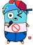

    

# 🎤 GophEngine

**English 🇺🇸** | **[Slovenčina 🇸🇰](docs/README.sk.md)**

**Status:** In development

     

**GophEngine** (short for "Gopher Engine") is a Go port of **Friday Night Funkin'** (a popular FOSS rhythm game) with improvements, bringing new features, performance enhancements, and a cleaner experience. Built from the ground up in **Go and Ebitengine**, GophEngine aims to provide an easy-to-use modding framework and foster a supportive community for FNF fans.

> [!NOTE]
> This is not the vanilla game. This is a fan-made remake of the original game and is not affiliated with or endorsed by the Funkin' Crew or Newgrounds.
> Think of GophEngine as to FNF what Black Mesa is to Half-Life - a fan-made remake and improvement, built from the ground up.

## Why?

I created GophEngine for several reasons:

* To develop an easy-to-use Go modding MDK for Friday Night Funkin', similar to MinecraftForge but for FNF.
* To fix issues in the vanilla FNF engine and add new features and improvements.
* To foster a positive and supportive community around the game, free from the toxicity often seen in other modding circles.
* To remove inappropriate or overly graphic content introduced in later FNF versions and create a cleaner, more accessible version of the game.
* To rewrite the game in Go, my favorite programming language.

### Why Go?

Go is my favorite programming language, and I prefer it over learning Haxe.
It also offers better performance, simpler concurrency, and faster compile times compared to Haxe, making it ideal for building a high-octane rhythm game like FNF.

## Planned Features

* Enhanced privacy with no Newgrounds integration
* Entirely written in Go with no Haxe
* Family-friendly and strict Code of Conduct
* Small tweaks and optimizations for a smoother and more enjoyable experience
* Lower RAM consumption and overall smaller footprint
* A proper options menu for better customization
* Robust Go modding MDK for easy modification
* Faster compile times
* ...and much more! 😉

## Hardware Requirements

| Component         | Minimum                                                                            | Recommended                                                             |
|-------------------|------------------------------------------------------------------------------------|-------------------------------------------------------------------------|
| Processor         | Intel Core i3 / AMD Ryzen 3                                                        | Intel Core i5 / AMD Ryzen 5                                             |
| Memory            | 4 GB                                                                               | 8 GB                                                                    |
| Graphics Card     | Intel HD Graphics 4000 / NVIDIA GeForce GTX 600 Series / AMD Radeon HD 7000 Series | Intel HD Graphics 5000 / NVIDIA GeForce GTX 750 Ti / AMD Radeon RX 560  |
| DirectX / OpenGL  | DirectX 11 / OpenGL 3.0                                                            | DirectX 12 / OpenGL 4.5                                                 |
| Storage           | 256 MB                                                                             | 512 MB                                                                  |
| Operating System  | Windows 7 / macOS 10.12 / Linux Kernel 3.x.x                                       | Windows 11 / macOS 10.15 / Linux Kernel 5.x.x                           |

## Building & installing (from source)

For detailed build instructions, refer to [BUILDING.md](BUILDING.md).
You'll need Go installed and basic command-line knowledge to get started.

## Naming

The name "GophEngine" combines "Goph" (representing Gopher, the Go programming language mascot) and "Engine" (representing the FNF engine). It felt more fitting and natural for this project than the alternative proposed name "funkin-go".

## Contributing

We welcome contributions! Please see [CONTRIBUTING.md](CONTRIBUTING.md) for details on how to get started.

## License

Licensed under **Apache License 2.0** (see [LICENSE](LICENSE))

### Credits

* **The Funkin' Crew** - Original game and assets (see [LICENSE-FNF](LICENSE-FNF) and [LICENSE-ASSETS](LICENSE-ASSETS))
* **Hajime Hoshi** - Ebitengine
* [The Ebitengine logo](https://ebitengine.org/images/logo.png) by Hajime Hoshi is licensed under [the Creative Commons Attribution 4.0](https://creativecommons.org/licenses/by/4.0/).
* The Go Gopher mascot was created by Renee French and is licensed under the [Creative Commons 4.0 Attribution License](https://creativecommons.org/licenses/by/4.0/).

## ❤️ Donate

If you enjoy playing GophEngine and would like to support its development, here are a few ways you can contribute:

1. ⭐ Star the Repo
    Stars are a great way to show your support! If you like GophEngine, please consider starring this repository. Your stars help attract more contributors and improve the project!
2. 🤝 Contribute
    Issues and pull requests are welcome! Whether you're fixing bugs, adding features, or improving documentation, there’s always room for help. Check out the [CONTRIBUTING.md](CONTRIBUTING.md) for more details on how you can get involved. If you're new to the project, check out issues labeled "good first issue" to dive in!
    * **Want to help but don't code?** You can contribute by suggesting improvements, reporting bugs, fixing typos, translating, or sharing your feedback!
3. 💲 Donate
    If you prefer supporting financially, you can donate using the following options. Every bit helps keep the development going (and my love for [Kofola](https://kofola.cz/en))!
    You can donate through the following platforms:
    * **Bitcoin (BTC):** `bc1qtykrhm2ar9jreha5rnqve72lutw02jzpu6lcgs`
    * **Duino-Coin (DUCO):** `SladkyCitron`
    * **Magi (XMG):** `9K8GrfCGEvTK7qjDMVtkGE18UfRyUkv5QT` or `SladkyCitron`

Thank you for your support - it means the world! 😊❤️
